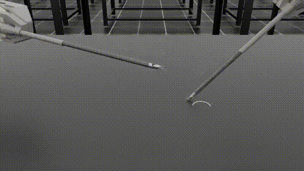

# Learning Surgical Augmented Dexterity - A Reinforcement Learning Framework for Dual-Arm Robotic Control



## Overview

This project tackles the **Needle Handover task** using dual dVRK arms in the [Orbit Surgical framework](https://orbit-surgical.github.io/), leveraging reinforcement learning for precise, coordinated control.

We build upon the **Orbit Surgical** platform, which provides simulation and control tools for surgical robotics. Full installation and setup instructions can be found on the [Orbit Surgical GitHub](https://github.com/orbit-surgical/orbit-surgical).

---

## Usage

To train the RL model for the needle handover task (exact command available in `train_handover.txt`):

```bash
${IsaacLab_PATH}/isaaclab.sh -p source/standalone/workflows/rsl_rl/train.py     --task Isaac-Handover-Needle-Dual-PSM-v0     --num_envs 32     --max_iterations 1000     --headless     --video --video_length 300 --video_interval 2000
```

> Make sure to follow the Orbit Surgical installation steps [here](https://github.com/orbit-surgical/orbit-surgical/blob/main/README.md).

---

## Main Code

Here are the key components of our implementation:
- `source/needle_handover/train.py` – training loop
- `source/extensions/orbit.surgical.tasks/orbit/surgical/tasks/surgical/handover/handover_env_cfg.py` – custom dual-arm needle handover environment config
- `source/extensions/orbit.surgical.tasks/orbit/surgical/tasks/surgical/handover/handover_env_cfg.py` – RL policy architecture has three files:  
.
├── `observations.py`: observation space  
├── `rewards.py`: reward function(s)  
└── `terminations.py`: termination conditions  

---

## Acknowledgements

This project is built on the [Isaac Sim](https://isaac-sim.github.io/), [Isaac Lab](https://isaac-sim.github.io/IsaacLab/main/index.html) and [Orbit Surgical](https://orbit-surgical.github.io/) frameworks. We acknowledge the contributions of the Nvidia and Orbit Surgical teams in providing the foundational tools for this research.

Our work, is largely built upon the work done in the [Orbit Surgical Github Repo](https://github.com/orbit-surgical/orbit-surgical).

This project was done by:
- Amog Rao
- Ananya Shukla
- Malhar Bhise
- Utkarsh Agarwal
