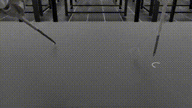
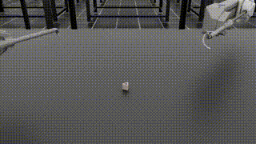
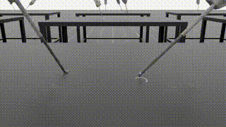
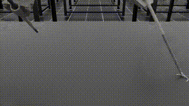
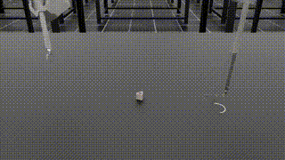
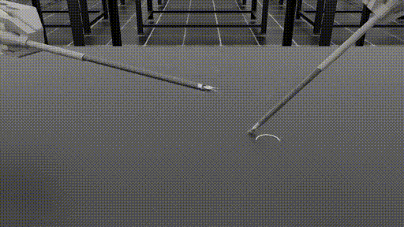

# Journey of training through multimedia

### 1. Failure

### 2. SO SO SO Many tries

Initially, we saw lot of erratic movement so we tried implementing penalties to the action space and joint space. (We needn't say this but it didn't work).

1. Action Penalty --> arms freeze

2. Joint Penalty --> Joints freeze

Eventually we started realizing that our dense reward function was not working as expected. We had to change the reward function to a sparse reward function.

3. Gripper Open (but balances needle)

4. Holding the needle (somewhat)

5. Keep trying and you'll eventually succeed

### 3. Eventual Success (this was just our best result)

