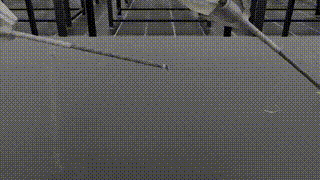

# RL Needle Handover — Training Journey

This repository documents our journey of training a reinforcement learning agent for a surgical needle handover task using Isaac Lab + ORBIT-Surgical. We started with no demonstrations or reference poses—only raw reward signals, trial and error, and a lot of debugging.

---

## Methodology

We began with **dense rewards**:
- Rewards for approaching the needle
- Penalties on large actions or joint velocities
- Distance shaping and time-based discouragements

However, these led to unstable learning and unintended behavior (freezing, flailing, balancing without grasping).

We later switched to a **sparse reward scheme**:
- **Positive** for lifting the needle with a closed gripper
- **Shaping penalty** that decreased as the needle approached a central goal zone

---

## 📈 Training Timeline

### 1. Failure

> Just chaotic exploration. No meaningful behavior.  

---

### 2. Iteration & Debugging

> We tried various reward designs. Most failed. But each failure taught us something new.

- **Action penalty → Frozen arms**  
  _Too much punishment for effort = inaction._  
  

- **Joint penalty → Locked joints**  
  _Smoothness cost caused joints to stop moving altogether._  
  

- **Gripper open/close penalty → Arm balances the needle**  
  _Agent lifts the needle using contact dynamics, not grasp._  
  

- **Holding the needle (somewhat)**  
  _Sparse reward begins working. Gripper closes and lifts._  
  

- **Multiple attempts, one success**  
  _Lots of noise, but needle eventually gets picked up._  
  

---

### 3. Success

> Our best result: .  

